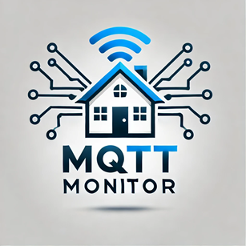

# MQTT_Monitor
MQTT_Monitor# MQTT Monitor

MQTT Monitor is a custom Home Assistant integration designed for real-time monitoring of MQTT topics and messages. This project provides a clean, responsive UI to view and analyze MQTT data, making it easy to monitor IoT devices and communication.

---

## Features
- Real-time MQTT message monitoring.
- Topic filtering and search functionality.
- Responsive design for desktop and mobile devices.
- Integration with Home Assistant dashboards using an iframe card.
- Displays MQTT messages with timestamps and payloads.

---

## Installation

### Manual Installation
1. Clone this repository or download the files as a ZIP.
2. Navigate to your Home Assistant configuration directory:
   ```bash
   cd /config
   ```
3. Create or navigate to the `custom_components` directory:
   ```bash
   mkdir -p custom_components
   ```
4. Place the `mqtt_monitor` folder into the `custom_components` directory.
5. Copy the `mqtt_monitor.html` file and `mqtt_monitor.png` logo to your `/config/www` directory:
   ```bash
   mkdir -p www
   cp mqtt_monitor.html mqtt_monitor.png www/
   ```
6. Restart Home Assistant for the changes to take effect.

---

## Directory Structure
```
/config
├── custom_components
│   └── mqtt_monitor
│       ├── __init__.py
│       ├── manifest.json
│       └── sensor.py
├── www
│   ├── mqtt_monitor.html
│   └── mqtt_monitor.png
├── configuration.yaml
```

---

## Configuration

### Example `configuration.yaml`
Add the following configuration to your `configuration.yaml` file:
```yaml
sensor:
  - platform: mqtt_monitor
    name: "MQTT Monitor"
    broker: "broker_ip"    # Replace with your MQTT broker's IP
    port: 1883             # Default MQTT port
    username: "mqtt_user"  # Your MQTT username
    password: "mqtt_pass"  # Your MQTT password
    monitor_topic: "#"     # Topic to monitor (use '#' for all topics)
    client_id: "mqtt_monitor"
```

### Example `http:` Configuration
To enable the HTML interface in Home Assistant, add this to your `configuration.yaml`:
```yaml
http:
  use_x_forwarded_for: true
  trusted_proxies:
    - 127.0.0.1
    - ::1
  cors_allowed_origins:
    - "http://your-home-assistant-ip:8123"  # Replace with your Home Assistant IP or hostname
```
After editing, restart Home Assistant.

---

## Adding the Dashboard to Home Assistant

### Embedding the HTML in Lovelace
Use an **iframe card** to display the `mqtt_monitor.html` file in your Home Assistant dashboard.

#### Option A: UI Editor
1. Go to **Settings** > **Dashboards** > **Edit Dashboard**.
2. Click **Add Card** > Select **Manual** card.
3. Paste the following YAML:
   ```yaml
   type: iframe
   url: /local/mqtt_monitor.html?v=1
   title: MQTT Monitor
   ```
4. Save the changes.

#### Option B: YAML Configuration
Add this to your Lovelace YAML configuration:
```yaml
views:
  - title: Home
    cards:
      - type: iframe
        title: MQTT Monitor
        url: /local/mqtt_monitor.html?v=1
```
After saving, reload your dashboard.

---

## Usage
1. Open the MQTT Monitor dashboard in Home Assistant.
2. Use the **Topic Filter** dropdown to select specific topics.
3. Enter a search term in the **Search Bar** to filter topics.
4. View MQTT messages in real-time, sorted by timestamp.

---

## Screenshots

### Dashboard Example


---

## Troubleshooting
- Ensure the MQTT broker is running and reachable.
- Verify that the `mqtt_monitor.html` file is placed in the `/config/www` folder.
- Check Home Assistant logs for errors related to the integration.
- Clear your browser cache if the dashboard does not load correctly.

---

## Support
For issues, questions, or feature requests, please visit the [GitHub Repository]((https://github.com/mantiz010/MQTT_Monitor)

---

## License
This project is licensed under the MIT License. See the [LICENSE](LICENSE) file for details.
